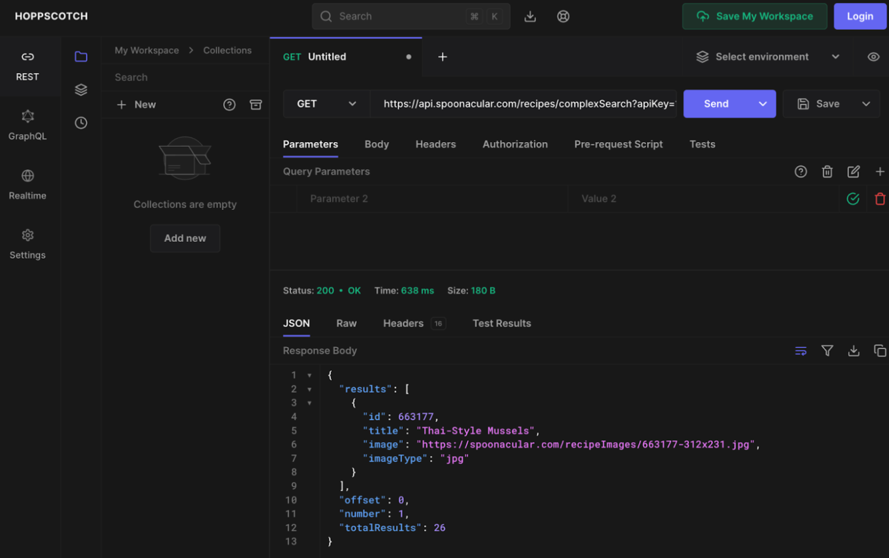

# Group Project Idea

API: https://spoonacular.com/food-api/docs#Search-Recipes-Complex

The problem domain our group will be focusing on is meal planning. Our team is considering an application where users
can input food intolerances, a budget, type of cuisine, and equipment available into the request parameters and
receive a few recipes that meet their specified guidelines.

Testing out the API:

GET request to:
https://api.spoonacular.com/recipes/complexSearch?apiKey=1b1f342ee2a54ef39cd07aabf1809ef1&cuisine=thai&intolerance=gluten&number=1

Sample output:

Response{protocol=h2, code=200, message=, url=https://api.spoonacular.com/recipes/complexSearch?apiKey=1b1f342ee2`a54ef39cd07aabf1809ef1&cuisine=thai&intolerance=gluten&number=1}
{"number":1,"totalResults":26,"offset":0,"results":[{"image":"https://spoonacular.com/recipeImages/663177-312x231.jpg","id":663177,"title":"Thai-Style
Mussels","imageType":"jpg"}]}
